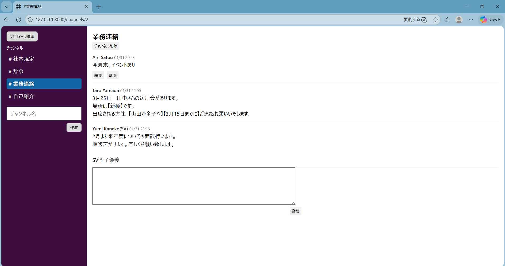
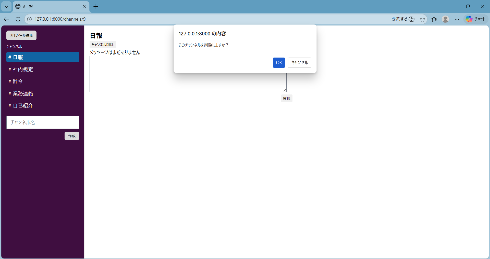
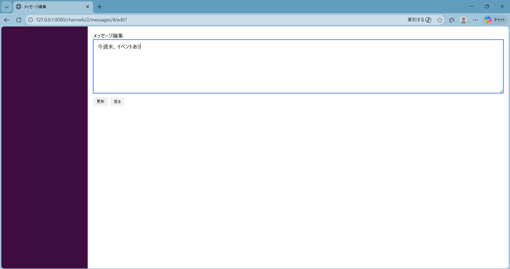
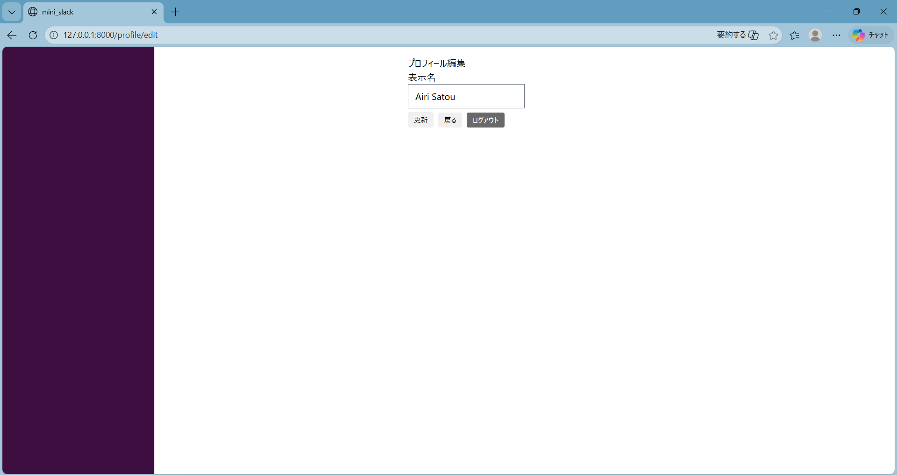

# mini_slack
Laravelで作成した、Slack風のチャンネル型チャットアプリです。
ユーザー認証、チャンネル管理、メッセージ投稿などの基本機能を実装しています。

##　主な機能
- ユーザー登録 / ログイン / ログアウト
- チャンネル作成・削除
- チャンネルごとのメッセージ投稿・削除・編集
- 最後に閲覧したチャンネルへの自動遷移
- プロフィール編集機能

## 工夫した点
- チャンネル一覧とメッセージ表示を同一画面で行い、Slackに近いUIを意識
- チャンネル削除は、チャンネル作成者のみ可能に制御
- プロフィール編集で、登録名とは別の表示名を設定できるように実装
- ログイン後、ユーザーが最後に閲覧したチャンネルへ自動で遷移するように実装

## 画面
- チャンネル一覧・メッセージ表示（/channels/{channel}）

- チャンネル削除（/channels/{channel}）

- メッセージ編集（/channels/{channel}/messages/{message}/edit）

- プロフィール編集（/profile/edit）



## 使用技術
- PHP 7.4
- Laravel 8
- MySQL
- Blade
- CSS

## セットアップ方法
```bash
git clone git@github.com:AiriSatou/mini_slack.git
cd mini_slack
composer install
cp .env.example .env
php artisan key:generate
php artisan migrate
php artisan serve
---
